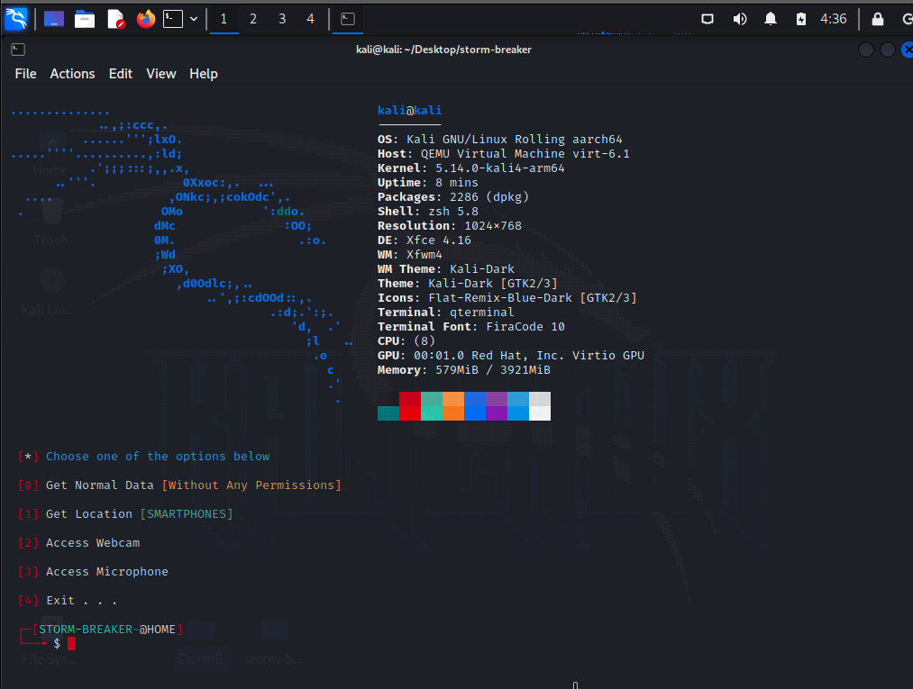

<h1 align="center">
  <br>
  <a href="https://github.com/ultrasecurity/Storm-Breaker"></a>

</h1>

<h4 align="center">A tool with attractive capabilities</h4>

<p align="center">

  <a href="http://python.org">
    
  </a>
  <a href="https://php.net">
    
  </a>

  <a href="https://en.wikipedia.org/wiki/Linux">
    
  </a>

</p>



### Features:

- Get Device Information Without Any Permissions
- Access Location [SMARTPHONES]
- Access Webcam
- Access Microphone


### Update Log:
- Second(latest) Update in  November 03, 2022
- The overall structure of the tool is programmed from the beginning and is available as a web panel (in previous versions, the tool was available in the command line).
- Previous versions bugs fixed
- Added auto-download ngrok
- The templates are optimized
- Logs can be downloaded
- It can be uploaded on a personal host (you will not have the problems of ngrok anymore)
- You can start and stop the listener (at will)
- Beautiful user interface


> We have deleted ngrok in the new version of storm breaker and entrusted the user with run and share the localhost. So please note that storm breaker runs a localhost for you and you have to start the ngrok on your intended port yourself.

#### Attention!:
> This version can be run both on local host and on your personal domain and host. In any case, you can use it for both situations. If your country has filtered the ngrok service, or your country has banned ngrok, or your victim cannot open the ngrok link (for the reasons that he sees such a link as suspicious, or if this service is filtered in his country), we suggest. The use of the tool is on personal hosting and domain


### Dependencies

**`Storm Breaker`** requires following programs to run properly - 
- `php`
- `python3`
- `git`
- `ngrok`


### Operating Systems Tested

- Kali Linux 2022 
- macOS Big Sur / M1 
- Personal hosting (direct admin and cPanel) 

### Installation On Kali Linux 


```bash
$ git clone https://github.com/ultrasecurity/Storm-Breaker
$ cd Storm-Breaker
$ sudo bash install.sh
$ sudo python3 -m pip install -r requirements.txt
$ sudo python3 st.py
```

### how to run personal host


```bash
Zip the contents of the storm-web folder completely and upload it to the public_html path


Note that the tool should not be opened in such a path > yourdomain.com/st-web

Rather, it should be opened purely in the public_html path (i.e., don't just zip the storm-web folder itself, but manually zip its contents (the index.php file and other belongings should be in the public_html path)
```


</p>
