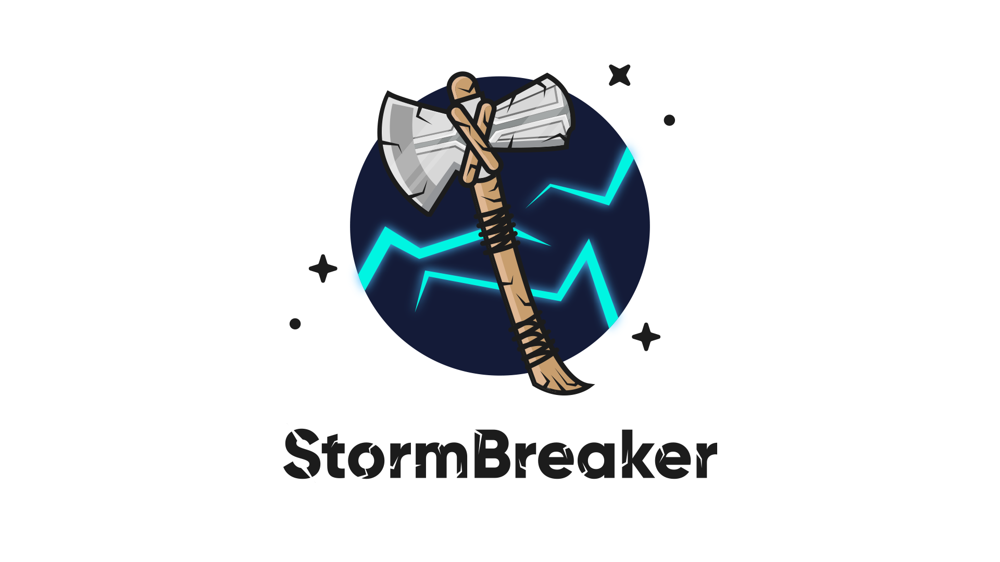
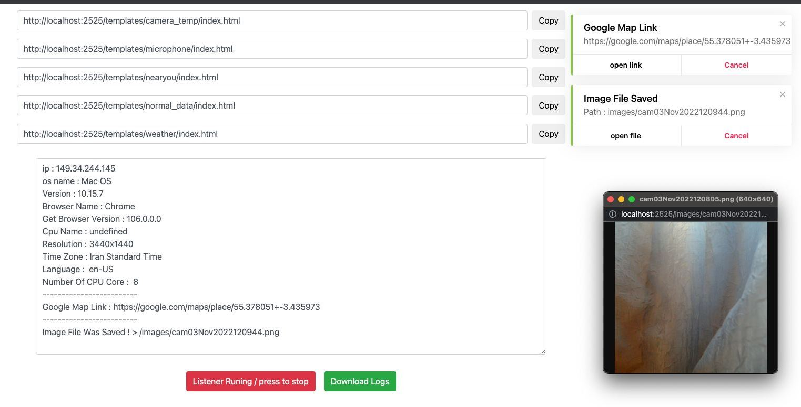

<h1 align="center">
  <br>
  <a href="https://github.com/ultrasecurity/Storm-Breaker"></a>

</h1>

<h4 align="center">A Tool With Attractive Capabilities. </h4>

<p align="center">

  <a href="http://python.org">
    
  </a>
  <a href="https://php.net">
    
  </a>

  <a href="https://en.wikipedia.org/wiki/Linux">
    
  </a>

</p>



### Features:

- Obtain Device Information Without Any Permission !
- Access Location [SMARTPHONES] 
- Access Webcam 
- Access Microphone 

<br>

### Update Log:
- Second (latest) Update on  November 4th , 2022 .
- The overall structure of the tool is programmed from the beginning and is available as a web panel (in previous versions, the tool was available in the command line).
- Previous version's bugs fixed !
- Auto-download Ngrok Added !
- The templates have been optimized !
- Logs can be downloaded (NEW) !
- Clear log Added !
- It can be uploaded on a personal host (you won't have the Ngork problems anymore)
- You can start and stop the listener anytime ! (At will)
- Beautified user interface (NEW) !


> We have deleted Ngrok in the new version of Storm breaker and entrusted the user with running and sharing the localhost . So please note that Storm breaker runs a localhost for you and you have to start the Ngrok on your intended port yourself .
<br>

#### Attention! :
> This version can be run on both local host and your personal domain and host . However , you can use it for both situations. If your country has suspended the Ngrok service, or your country's banned Ngrok, or your victim can't open the Ngrok link (for the reasons such as : He sees such a link as suspicious, Or if this service is suspended in his country) We suggest using the tool on your personal host and domain .
<br>

## Default username and password:
- `username` : `admin`
- `password` : `admin`
- You can edit the config.php file to change the username and password .
<br>

### Dependencies

**`Storm Breaker`** requires following programs to run properly - 
- `php`
- `python3`
- `git`
- `Ngrok`

<!--  -->
<br>

### Platforms Tested

- Kali Linux 2022 
- macOS Big Sur / M1 
- Personal host (direct admin and cPanel) 
<br>

### Installation On Kali Linux 


```bash
$ git clone https://github.com/ultrasecurity/Storm-Breaker
$ cd Storm-Breaker
$ sudo bash install.sh
$ sudo python3 -m pip install -r requirements.txt
$ sudo python3 st.py
```
<br>

**`how to run personal host 👇`**

> Zip the contents of the storm-web folder completely and upload it to the public_html path .

> Note that the tool should not be opened in a path like this > yourdomain.com/st-web
> Instead , it should be opened purely in the public_html path (i.e. :  don't just zip the storm-web folder itself, but manually zip its contents (the index.php file and other belongings should be in the public_html path)

#### Attention!:
>Note that to use this tool on your Localhost , You also need SSL . Because many of the tool's capabilities require SSL .
</p>
