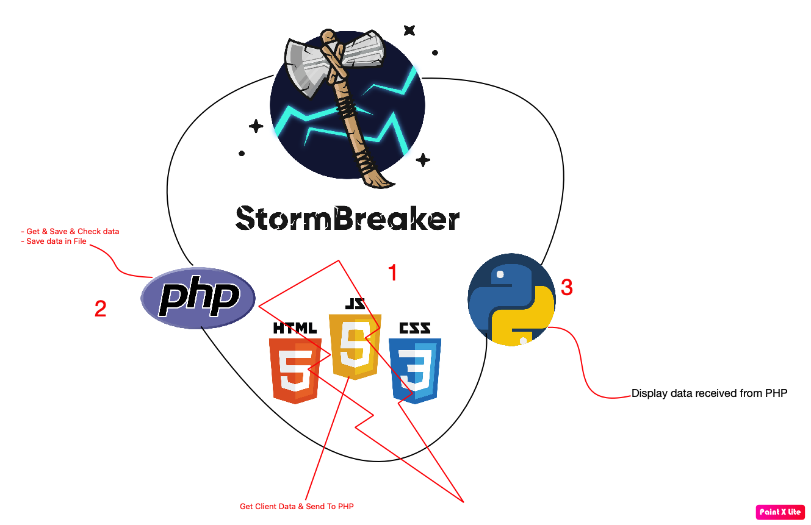

<h1 align="center">
  <br>
  <a href="https://github.com/ultrasecurity/Storm-Breaker"></a>

</h1>

<h4 align="center">A tool with attractive capabilities</h4>

<p align="center">
  <a href="http://python.org">
    
  </a>
  <a href="https://php.net">
    
  </a>

  <a href="https://www.microsoft.com/de-de/">
    
  </a>
</p>


### Features:

- Get Device Information Without Any Permissions
- Access Location [SMARTPHONES]
- Access Webcam
- Access Microphone


### Update Log:
- Second(latest) Update in  April 9, 2022
- The overall structure of the tool is programmed from scratch
- Previous version bugs fixed

> We are in the new version of Storm Breaker. We have removed ngrok and leave the implementation and the localhost sharing process to the user!

<h3 align="center">
:: More Explanation ::
</h3>
<p align="center">

</p>

### Dependencies

**`Storm Breaker`** requires following programs to run properly - 
- `php`
- `neofetch`
- `python3`
- `git`


### Operating Systems Tested

- Kali Linux 2022
- macOS Big Sur / M1 

### Installation On Kali Linux


```bash
$ git clone https://github.com/ultrasecurity/Storm-Breaker
$ cd Storm-Breaker
$ sudo bash install.sh
$ python3 -m pip install -r requirements.txt
$ python3 st.py
```


<h3 align="center">
:: Workflow ::
</h3>
<p align="center">

<br>


 
</p>
